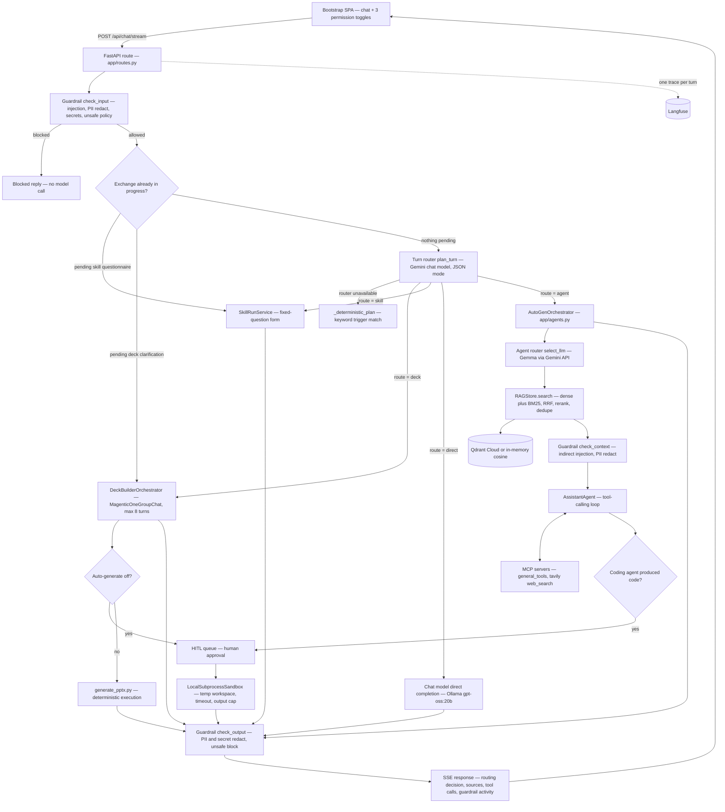
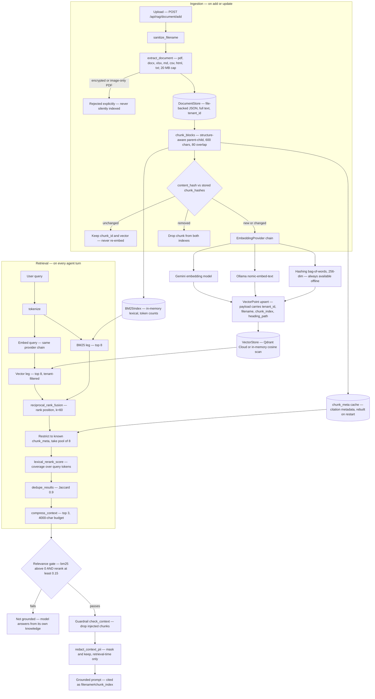

# Enterprise Copilot

A self-hosted enterprise copilot whose guardrails, retrieval and human-approval gates are owned and inspectable by the operator rather than trusted to a vendor.

**Author:** Anish S
**Date:** 2026-08-23
**Course:** Agentic AI For Developers - Hexaware

---

## 1. Executive Summary

Enterprise Copilot is a runnable FastAPI + Bootstrap application that does the things a
commercial enterprise copilot does — grounded chat over your own documents, live web
research, tool calling, and real file generation — while keeping the safety layer in the
operator's own codebase (Updating to codesandboxes [OnlineCompilerProvider]+[E2B]). Every turn passes an input guardrail, a retrieved-context
guardrail and an output guardrail, and the UI shows what each one caught. Risky actions
(generated code, deck generation) stop at a human-approval queue before anything runs.

Three findings matter most. First, the safety layer was cheap to build and is the part
that most justifies self-hosting: it is regex-and-policy based, always available, and
visible per turn. Second, graceful degradation is what makes the system demonstrable —
every external dependency (Gemini, Ollama, Qdrant, Tavily, Langfuse, MCP) falls back to an
offline path, so the whole product runs with zero credentials. Third, agent quality is
**not measured**: 395 automated tests verify behaviour, but no evaluation of answer
quality, latency or cost has been run as of now. 

## 2. Problem and Users

Adopting a vendor's enterprise copilot means accepting the vendor's protection as
given. The guardrails, the retrieval boundary, the decision about what the model is
allowed to execute, and the record of what was screened all sit inside a product the
operator cannot inspect or change. When a security or compliance question is asked, the
answer is a vendor assurance rather than code the operator can read. This project
inverts that: the copilot runs on the operator's own infrastructure, and the guardrail,
retrieval and approval layers are ordinary source files in the repository.

The intended users were **not specified** beyond this framing. The problem statement
implies organisations and teams that want copilot capability but need to own the
protection layer rather than trust it; specific role, industry and organisation size are
in the gaps list.

This needs an agent rather than a plain script for four reasons, each visible in the
code. **Routing is a judgement, not a lookup** — `plan_turn` decides whether a message
wants a file generated, multi-step work, or a direct answer; the keyword chain it
replaced misread "what did last quarter's presentation say about churn?" as a request to
build a deck. **Grounding is conditional** — the orchestrator retrieves on every turn but
only grounds when a relevance gate passes, then hands the model the context and lets it
decide whether the excerpt genuinely answers the question. **Tool use is decided per
call** — the model chooses whether web search or an MCP utility is worth invoking.
**Some flows are genuinely conversational** — the Deck Builder plans, asks clarifying
questions across turns, researches, and only then drafts a specification. A script can
do none of these without hard-coding the decisions the model is there to make.

## 3. Scope

**In scope**

- Streaming and non-streaming chat with mid-turn cancellation, session persistence, and buffered-plus-summarised conversation memory.
- Three-stage guardrails (input, retrieved context, output) with per-turn UI reporting.
- Full document lifecycle RAG: add, list, view/edit, update, delete, immediate re-index; hybrid dense + BM25 retrieval with RRF fusion and reranking.
- Agent layer behind an `AgentOrchestrator` contract: LLM turn routing, LLM agent routing, MCP tool calling, HITL gates for code execution and deck generation.
- Skill packages producing real `.docx`, `.pptx` and `.pdf` files; multimodal image input; optional Langfuse tracing.
- The infrastructure replacements listed under *Feature enhancements in progress* below — unfinished in-scope work, not deferred features.

**Out of scope**

- The `.claude/` Claude Code kit (agents, rules, commands, project skills).
- Real authentication, real multi-tenancy (the `tenant_id` seam exists; one tenant is used), and multi-worker deployment.
- A hardened execution sandbox *in this submission* — local subprocess execution is development-only; its replacement is in progress below.
- Evaluation of agent answer quality (see §8).

### Feature enhancements in progress

Each item replaces a component that is explicitly a v1 placeholder, and each slots behind
an interface that already exists — so none of them is a rewrite. **No implementation has
started for any of them:** the repository contains the seam and the documented intent, not
the replacement. Deployment to a server with a shareable link is targeted for the week of
2026-08-30.

| Enhancement | Replaces or adds | Seam it slots behind | Status |
|---|---|---|---|
| E2B sandbox + online-compiler provider | `LocalSubprocessSandbox`, which is a plain OS subprocess with no isolation boundary | `CodeSandbox` (`app/sandbox.py`) | Planned and started |
| Postgres (Neon) | The five file-backed JSON stores — sessions, documents, HITL requests, artifacts, skill runs — with one normalised schema carrying `org_id` and Row-Level Security from day one | `SessionStore`, `DocumentStore`, `ArtifactStore`, `HitlService`, `SkillRunService` | Planned and started |
| Redis (Upstash) | The two pieces of in-process state that cannot survive a second worker: the live HITL decision wait (`HitlService._decision_futures`) and the in-flight stream registry (`_active_streams`) | Existing call sites in `app/services.py` and `app/routes.py` | Planned and started |
| Filebase (S3-compatible object storage) | Local-disk storage of document text, artifact bytes and generated skill output | `ArtifactStore` / `DocumentStore` | Planned and started |
| Server deployment + public link | Local-only `uvicorn` run | `Dockerfile` already present | Targeted this week |
| Multi-participant Magentic-One | The Deck Builder's current single-participant group chat | `DeckBuilderOrchestrator` | Deferred to a later phase; not attempted |

## 4. Architecture

**One agent-mode request, end to end.**

1. The SPA posts the message with three toggles — Agent mode, Web Search, Auto-generate. These are permissions, not modes: they bound what may be chosen, and compose on a single turn.
2. `GuardrailService.check_input` screens the raw message. Injection patterns and unsafe-content categories block the turn outright; PII and secrets are redacted in place and the message is reassigned to the redacted text before it reaches session history, the trace, or any prompt.
3. `CopilotService.chat` checks whether an exchange is already underway. A half-finished skill questionnaire or deck clarification continues first — it is a conversation in progress, not a new request to classify.
4. Otherwise `plan_turn` makes one small JSON-mode call and returns a `TurnPlan`: route, skill id, an advisory `needs_web`, and a short user-visible reason. If the router is unavailable, fails, or answers unusably, `_deterministic_plan` reproduces the previous keyword-trigger chain exactly.
5. On the agent route, `AutoGenOrchestrator.run` calls `AgentRegistry.select_llm` to pick the specialist agent, falling back to keyword matching.
6. `RAGStore.search` runs both retrieval legs, fuses them by reciprocal rank position, reranks by lexical coverage, dedupes near-duplicates and compresses to the context budget. For non-research agents the results must clear a relevance gate — genuine BM25 overlap **and** a rerank score above threshold — before they are used at all.
7. Surviving chunks pass `check_context` for indirect prompt injection; flagged chunks are dropped, and PII in the remainder is masked at retrieval time only, leaving source documents unredacted.
8. If MCP tools loaded and a real model client exists, an `AssistantAgent` runs a tool-calling loop; web search results are parsed from the tool output so citations are the ones the model actually saw. Any failure — or a successful-but-empty result — degrades to a plain completion rather than failing the turn.
9. For the coding agent, a fenced code block in the model's own answer is extracted and queued for human approval. Nothing executes inline.
10. `check_output` screens the reply, redacting PII and secrets and blocking unsafe content, before the response, its routing decision, sources, tool calls and guardrail activity stream back to the UI.

## 5. Agent Design

| Agent | Role | Tools it may call | When it hands off | How it terminates |
|---|---|---|---|---|
| `AutoGenOrchestrator` | Owns every agent-mode turn: agent selection, RAG grounding, tool calling, code gating | `RAGStore.search`, MCP `general_tools` + `web_search`, `HitlService` | To `_queue_generated_code` when the coding skill is active; to the plain completion path when tool calling fails or returns empty | Returns one `OrchestrationResult`; single pass, no loop of its own |
| `general` | Direct answer for simple single-step requests | None beyond the relevance-gated knowledge base | Upgraded to `research-agent` only if auto-grounding finds relevant sources | One completion |
| `coding-agent` | Implement, test, debug; the only agent that can produce a downloadable file, by writing code | MCP tools; its code goes to the HITL queue | Always to the human-approval queue before execution | Completion, then queue-and-return, or an awaited live decision on the SSE path |
| `research-agent` | Answer from indexed organisational knowledge with citations | `RAGStore.search`, MCP tools | Never; it is the grounding terminus | One grounded completion citing `[filename#chunk_index]` |
| `data-analysis-agent` | Analyse data, produce validated insights and charts | MCP tools; code path shared with the coding agent | Same HITL gate when it emits code | One completion |
| `DeckBuilderOrchestrator` / `deck_builder` | Plan, ask clarifying questions, research, then draft a deck specification as JSON | MCP `web_search` when the toggle permits | To `HitlService` when Auto-generate is off; to `generate_pptx.py` when on | `max_turns=8` per chat turn, or a parseable spec, or a fallback spec |
| `UserProxyAgent` (`hitl_agents.py`) | Represents the human approver inside AutoGen | None — bridges to `HitlService.await_decision` | Receives the decision, returns it to the orchestrator | Resolves when a human posts to `/api/hitl/decide` |
| `CodeExecutorAgent` (`hitl_agents.py`) | The single place approved code actually runs | `SandboxCodeExecutor` over `LocalSubprocessSandbox` | Returns result and captured artifacts | Script termination, timeout, or output cap |

Four decisions shape this. **AutoGen sits behind a contract, not in front of one.**
Application code depends on `AgentOrchestrator`; `autogen_agentchat` is imported in exactly
three files. AutoGen was chosen because it supports the full range of functionality a
copilot needs — group chat, tool calling, code execution, human proxying — in one
framework. Microsoft Agent Framework is a planned replacement of the implementation, not
a rejected alternative.

**Registered agents are specialisations inside agent mode, not separate products.** They
are selected by an LLM classifier over each agent's stated purpose, with keyword matching
as the fallback, because a genuinely ambiguous message — "walk me through what's going
wrong here" — contains none of the trigger words a keyword matcher needs and always fell
to `general`.

**Autonomy is applied to relevance, not just retrieval.** Rather than forcing the model to
answer only from retrieved context, the orchestrator hands over what it found and says
plainly that it may be irrelevant. That avoids the failure mode where a weak lexical match
produces "the context doesn't cover that" on a question the model could have answered.

**The model drafts; application code executes.** Every generator in the app splits
"model produces JSON" from "fixed script runs deterministically". The Deck Builder is
Magentic-One with a single participant — multi-participant was not attempted and is
planned for a later phase.

## 6. Data and Knowledge

The two halves of the pipeline — ingestion on document write, retrieval on query — share
only the embedding provider and the two indexes between them:

**Sources.** Users upload documents through the Knowledge tab. Extraction supports plain
text (`.txt`, `.md`, `.json`, `.log`, `.csv`, `.html`) directly and `.pdf`, `.docx`,
`.xlsx` as base64 binary uploads, capped at 20 MB. Encrypted and image-only PDFs are
rejected explicitly rather than silently indexing nothing. Testing used **5 documents —
PDF, Word and HTML** — which are **not committed** to the repository. What is committed in
`data/documents/` is four files: a 90-byte bootstrap `welcome.md`, two ~100-byte
verification stubs, and one 1.3 KB résumé — none of which constitute a corpus.

**Preparation and indexing.** Ingestion runs extract → clean → structure-aware
parent-child chunking → embed → index. Chunks are 600 characters with 80 characters of
overlap, packed paragraph-aware so headings and tables survive rather than being
flattened. Each chunk carries a content hash, so an update re-embeds only the chunks that
actually changed and leaves the rest untouched. Vectors go to Qdrant Cloud — genuinely
used, not just implemented — or to an in-memory exhaustive cosine scan when unconfigured;
every point carries an indexed `tenant_id`. Lexical search is a separate in-memory BM25
index. Embeddings come from Gemini or Ollama `nomic-embed-text` in configured mode, or a
256-dimension hashing-trick bag-of-words offline, which is fast and exact at this scale
but will not match "car" to "automobile".

**Retrieval.** Both legs return up to 8 candidates, fused by reciprocal rank position
rather than raw score, reranked over a pool of 8 by lexical coverage, deduped at 0.9
Jaccard, cut to the top 3 and compressed into a 4,000-character budget.

**Prompt versus run time.** The prompt carries only role instructions: a base agent-mode
system message, a coding addendum requiring fenced code blocks, a web-search addendum, and
the Deck Builder's `SKILL.md` body. Everything factual is retrieved at run time —
knowledge chunks with citations, live web results, the last 5 turns verbatim plus a running
compact summary of everything older, and the installed generator catalogue handed to the
router so an uploaded skill becomes routable immediately.

## 7. Implementation

**Stack.** FastAPI + Pydantic backend across 21 modules in `app/`; a Bootstrap SPA with no
build step (2,792 lines of JavaScript); AutoGen `autogen-agentchat` and
`autogen-ext[openai,mcp]`; Qdrant for vectors; MCP for tools; Langfuse for tracing;
`python-docx`, `python-pptx` and `reportlab` for file generation.

**Models, as actually configured.** `AI_MODE=configured`, `MODEL_PROVIDER=ollama`, chat
model **`gpt-oss:20b` self-hosted via Ollama**, 2,048-token output cap. Gemini serves the
two routing calls and, optionally, embeddings; `plan_turn` uses the configured Gemini chat
model while `AgentRegistry.select_llm` uses `gemma-4-26b-a4b-it`. Tavily, Qdrant Cloud and
Langfuse (US region) are all live. `MockProvider` is the always-available floor.

Three significant decisions follow. These are the ones the code documents explicitly with
their rejected alternative; **the author did not nominate his own three** (see gaps).

**1. AutoGen behind `AgentOrchestrator`, not called directly.** *Rejected:* importing
AutoGen types into routes and services, which is the shortest path and how most
tutorials do it. It was rejected because it makes the framework choice permanent —
`autogen_agentchat` is confined to three files precisely so the planned MAF migration
replaces an implementation instead of rewriting the application.

**2. The model drafts JSON; fixed application code executes it.** *Rejected:* letting the
model generate files through tool calls, or run its own code. Rejected because it puts
model output on the execution path for every generation. Instead `generate_pptx.py` runs
deterministically over a drafted spec, and the one place model-authored code can run at
all is behind a human-approval queue.

**3. Provider chains that end in an always-available offline implementation.** *Rejected:*
requiring credentials and failing the request when they are missing. Rejected because it
makes the system undemonstrable and untestable — the entire 395-test suite runs with no
network, and every flow works end to end with zero credentials, degrading quality rather
than availability. The same posture covers MCP servers, the vector store, and tracing.

A fourth decision is worth noting without numbers: `plan_turn` deliberately uses the
Gemini chat model rather than the Gemma router model, because Gemma's hidden reasoning
cannot be disabled and was blowing the provider's own HTTP timeout, silently degrading
routing to keyword matching. The latency figures in the code comments are **not measured**
and are not reported here.

## 8. Evaluation

**What exists today is engineering verification, not agent evaluation.** The distinction
matters and is stated plainly rather than blurred.

*Executed.* A pytest suite of **395 tests across 17 files**, run on 2026-08-23: all
passed in 87.51 seconds. It requires no network — `conftest.py` forces `AI_MODE=mock` and
redirects every file-backed store to a temporary directory, specifically so a developer's
real credentials in `.env` can never cause a test run to make live calls. Coverage by area:
agent layer 55 tests, skills 51, smoke 45, retrieval 36, extraction 25, model selection 23,
guardrails 22, turn routing 22, storage 21, sandbox 20, document store 16, vector store 14,
memory 12, MCP and observability 10, deck builder 9, streaming 8, checkpointing 6. Scoring
is entirely by code assertion — deterministic behaviour, API contracts, fallback paths,
guardrail pattern matching, chunking and fusion arithmetic. Each case runs once per
invocation. `docs/acceptance-tests.md` additionally holds a 40-item manual checklist,
with every box unticked.

*Not executed.* No dataset of realistic user requests. No answer-quality measurement of any
kind. No routing-accuracy measurement against labelled intents. No retrieval precision or
recall. No guardrail precision or false-positive rate. No latency, token or cost
measurement. No repeated runs to characterise variance. Langfuse traces from real usage
exist and carry latency, token and cost data, but no numbers have been extracted from them.

**Proposed evaluation design.** The following is a design, not a result.

*Dataset.* Roughly 120 cases, hand-written against the five routes and stored as JSON
alongside the test suite, each with the message, the toggle states, the expected route, and
a rubric or expected-substring assertion. Cases derived from the flows the code already
distinguishes, deliberately including the near-misses the code comments record as real
failures — "what did last quarter's presentation say about churn?" must route to `agent`,
not `deck`.

*Slices.* By route (direct / agent / skill / deck / continuing exchange); by toggle
combination, since the whole point of `plan_turn` is that the three compose; by grounding
outcome (relevant sources found versus correctly ignored); by degradation state (real
providers versus mock, Qdrant versus in-memory, tools available versus absent); and an
adversarial slice for injection, PII, secrets and unsafe content, including indirect
injection planted in an indexed document.

*Metrics and scoring.* Routing accuracy against labelled intent — **code check** against
`ChatResponse.routing`. Retrieval precision@3 and gate correctness — **human** labelling of
chunk relevance, once, reused thereafter. Answer groundedness and citation validity —
**model judge**, with a 20% human-audited subsample to estimate judge agreement. Guardrail
recall on the adversarial slice and false-positive rate on the benign slice — **code
check**, since both are deterministic given a fixed pattern set. HITL correctness, that no
code ever executes unapproved — **code check**. Latency p50/p95 and cost per turn — **code
check** from Langfuse traces.

*Runs per case.* Deterministic code-checked cases once. Every case touching a live model
five times, reporting median and spread — two routing calls plus a chat call per turn make
run-to-run variance a property worth measuring rather than averaging away.

## 9. Results

### Measured

| Metric | Value | How | Date |
|---|---|---|---|
| Automated tests passing | 395 / 395 | pytest, code assertions | 2026-08-23 |
| Test suite wall-clock | 87.51 s | pytest, single run | 2026-08-23 |
| Test files | 17 | repository count | 2026-08-23 |
| Network calls during test run | 0 | `AI_MODE=mock` forced in `conftest.py` | 2026-08-23 |
| Documents used in RAG testing | 5 (PDF, Word, HTML) | author-reported; not committed | — |
| Manual acceptance-checklist items completed | 0 of 40 | `docs/acceptance-tests.md`, all unticked | — |

### Quality

| Metric | Slice | Value | Scoring |
|---|---|---|---|
| Routing accuracy | all routes | not measured | — |
| Retrieval precision@3 | agent turns | not measured | — |
| Relevance-gate correctness | non-research agents | not measured | — |
| Answer groundedness | grounded turns | not measured | — |
| Citation validity | grounded turns | not measured | — |
| Guardrail recall | adversarial | not measured | — |
| Guardrail false-positive rate | benign | not measured | — |
| Deck spec validity | deck route | not measured | — |
| HITL correctness | code-producing turns | not measured | — |

### Cost and latency

| Metric | Value | Notes |
|---|---|---|
| Turn latency p50 / p95 | not measured | Langfuse traces exist; not extracted |
| Turn-router call latency | not measured | Code comments cite figures the author confirms are not reportable measurements |
| Agent-router call latency | not measured | As above |
| Input / output tokens per turn | not measured | Langfuse traces exist; not extracted |
| Cost per turn | not measured | Author reports cost was recorded; no figures supplied |
| Total project API spend | not measured | — |
| Tokens or cost by route | not measured | — |

### Gaps

Everything below is unmeasured, unverified, or unspecified. It is listed here rather than
smoothed over in the sections above.

1. **Agent quality is entirely unmeasured.** Every metric in the Quality table is absent. §8's design has not been executed.
2. **Cost and latency are unmeasured.** Langfuse traces containing this data exist and the author reports cost was recorded, but no figures were supplied, and none are invented here. Extracting them is the single highest-value next step.
3. **Latency figures in code comments are not reportable.** The "10–15 s" Gemma and "1–3 s" Gemini router timings, the "roughly half of all turns" degradation claim, and the "~0.18–0.33" relevance-score calibration are documented in source comments; the author confirms they are not measurements that can be cited.
4. **Intended users are unspecified** beyond "operators who want to own the protection layer" — no role, industry, or organisation size.
5. **The author's own three most significant decisions were not nominated.** §7 uses three the code documents with an explicit rejected alternative; the framing is the report's, not the author's.
6. **No RAG corpus is committed.** Five documents were tested but are not in the repository, so retrieval results are not reproducible. Committed content is a bootstrap file, two verification stubs and a résumé.
7. **Framework alternatives were never formally evaluated.** AutoGen was chosen on the basis that it supports the needed functionality. MAF is a deferred migration, not a rejected option.
8. **Multi-participant Magentic-One was not attempted.** The Deck Builder runs a single participant; multi-agent is deferred to a later phase.
9. **The 40-item manual acceptance checklist has never been completed**, so the manual verification the project defined for itself has not been run.
10. **Frontend integration was the main implementation difficulty**, per the author; no specific defects were catalogued.
11. **Every enhancement in §3's in-progress table is unstarted in code** — the repository holds the interface seam and the documented intent, not the replacement. Until they land the app is single-process, and generated artifacts, the live HITL decision wait and the in-flight stream registry do not survive a restart or a second worker. Server deployment is targeted for the week of 2026-08-30.
12. **Local code execution is not a security boundary.** It is a plain OS subprocess with a temp workspace, timeout and output cap; no namespace, seccomp or container isolation.
13. **Two documentation defects found while writing this report.** `README.md` claims 372 tests where 395 now pass, and `app/config.py` references `app/runtime_settings.py`, which does not exist — only `docs/runtime-settings.md` does.
