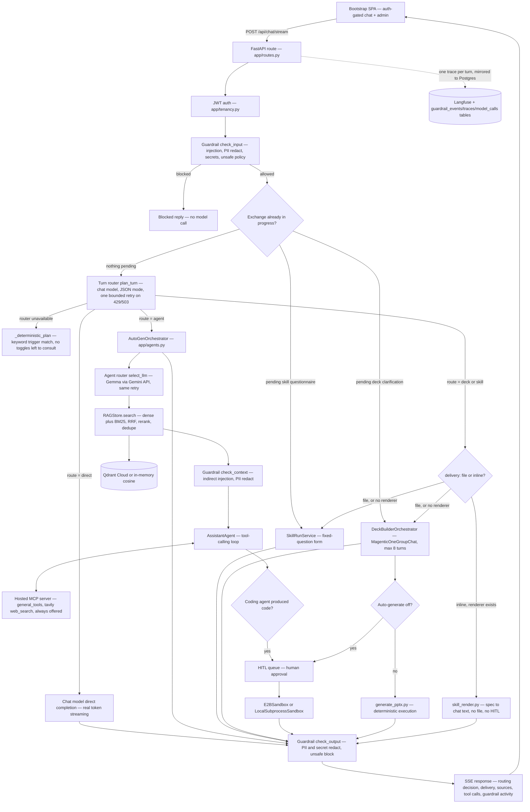

# Enterprise Copilot

A self-hosted enterprise copilot whose guardrails, retrieval, auth/approval workflow and human-approval gates are owned and inspectable by the operator rather than trusted to a vendor.

**Author:** Anish S
**Last Updated Date:** 2026-09-07
**Course:** Agentic AI For Developers - Hexaware

---

## 1. Executive Summary

Enterprise Copilot is a runnable FastAPI + Bootstrap application that does the things a
commercial enterprise copilot does — grounded chat over your own documents, live web
research, tool calling, and real file generation — while keeping the safety layer in the
operator's own codebase. Every turn passes an input guardrail, a retrieved-context
guardrail and an output guardrail, and the UI shows what each one caught. Risky actions
(generated code, deck generation) stop at a human-approval queue before anything runs.

Since the previous report (2026-08-23), every item listed there as "planned and started"
has actually landed: Postgres (Neon), Redis (Upstash), Backblaze B2, a real E2B sandbox,
a separately hosted MCP tool server, and — beyond what was scoped then — real
authentication with an admin-approval workflow, a full observability schema, and a
second live model provider (Azure AI Foundry) alongside Gemini and Ollama. The agent
routing layer was also substantially redesigned: the three manual composer toggles
(Agent mode, Web Search, Auto-generate) that the previous report's architecture diagram
depended on have been removed in favour of the router deciding, from the message alone,
whether a turn needs tools/grounding at all, and — new this round — whether a file
request should produce a downloadable file or just inline chat content.

Three findings matter most, updated from the previous report. First, the safety layer
remains cheap and the strongest self-hosting argument, now backed by a real database
schema (guardrail events, traces, model calls) rather than just per-turn UI reporting.
Second, graceful degradation is still what makes the system demonstrable — the test
suite (458 tests now, up from 395) still runs against zero live credentials by design.
Third, agent quality remains **not measured** — the gap identified in the previous report
is unchanged; the effort since has gone into infrastructure and routing correctness, not
evaluation.

## 2. Problem and Users

Unchanged from the previous report. Adopting a vendor's enterprise copilot means
accepting the vendor's protection as given — the guardrails, the retrieval boundary, the
decision about what the model may execute, and the record of what was screened all sit
inside a product the operator cannot inspect or change. This project inverts that: the
copilot runs on the operator's own infrastructure, and the guardrail, retrieval, auth and
approval layers are ordinary source files in the repository.

The intended users were **not specified** beyond this framing, and remain unspecified —
this gap is not resolved in this report either.

The agent-vs-script argument from the previous report holds and is strengthened by what
changed since. **Routing is now a judgement made with no manual override at all** —
where the previous report's `plan_turn` bounded its choice inside three user-set toggles,
the router now decides unconditionally, from the query, whether a turn needs tools,
grounding, or neither, and — new — whether a file-generating request wants a downloadable
file or a chat answer. A real regression this surfaced live: "can u make this above as a
docx" was mis-routed into a blank document-drafting form when the router itself was
temporarily unavailable (a genuine Gemini `503`), because the deterministic fallback path
has no judgement of its own and matches on the bare substring "docx" — fixed by adding a
bounded retry on transient upstream failures, not by hand-coding phrase matching into the
fallback, since that would reintroduce exactly the keyword-matching brittleness the
router was built to replace.

## 3. Scope

**In scope** (superset of the previous report — nothing in scope was dropped)

- Streaming and non-streaming chat with mid-turn cancellation, session persistence (now Redis-backed), and buffered-plus-summarised conversation memory.
- Three-stage guardrails (input, retrieved context, output) with per-turn UI reporting **and** persistent database logging (`guardrail_events`, `traces`, `model_calls`).
- Full document lifecycle RAG: add, list, view/edit, update, delete, immediate re-index; hybrid dense + BM25 retrieval with RRF fusion and reranking.
- Agent layer behind an `AgentOrchestrator` contract: autonomous turn routing (no manual toggles), autonomous inline-vs-file delivery routing, LLM agent routing, MCP tool calling (now via a separately hosted MCP service), HITL gates for code execution and deck generation.
- Skill packages producing real `.docx`, `.pptx` and `.pdf` files, either as a downloadable file or rendered as inline chat content depending on what the router judges the user wants; multimodal image input; optional Langfuse tracing.
- Real authentication (signup/login/JWT/refresh/logout), a superadmin-approval workflow for new signups, and role-gated admin endpoints.
- Three live model providers — Gemini, Ollama, and (new this round) Azure AI Foundry, including a real per-resource multi-deployment configuration for both chat and embeddings.
- Everything the previous report listed as "in progress": E2B sandbox, Postgres, Redis, B2, and a separately deployed MCP server — all now implemented and live-tested against real infrastructure, not just scaffolded.

**Out of scope**

- The `.claude/` Claude Code kit (agents, rules, commands, project skills).
- Real multi-tenancy beyond the `tenant_id` seam — one tenant is used in practice, same as the previous report; the schema carries the column but nothing exercises more than one tenant.
- Multi-worker deployment — the app is still single-process; Redis/Postgres/B2 now make that recoverable across a restart, but nothing has been tested with two workers running concurrently.
- Evaluation of agent answer quality (see §8 — unchanged from the previous report).
- Multi-participant Magentic-One for the Deck Builder — still single-participant, still deferred, per the previous report.

### What the previous report's "in progress" table looked like, and what actually happened

| Enhancement | Previous report's status | Actual outcome |
|---|---|---|
| E2B sandbox + online-compiler provider | Planned and started | Implemented — `E2BSandbox` (`app/sandbox.py`) is a real, network-isolated micro-VM via the E2B API, selected by `CODE_EXECUTION_MODE=e2b`. `CodeSandbox.run()` is now fully async. |
| Postgres (Neon) | Planned and started | Implemented — 18 tables across tenancy (`User`, `Tenant`, `UserTenant`, `RefreshTokenRow`, `UserApprovalRow`) and observability (`GuardrailEventRow`, `TraceRow`, `TraceEventRow`, `ModelCallRow`, `ModelPricingRow`, `UsageDailyRollupRow`), migrated via Alembic and running against live Neon Postgres. |
| Redis (Upstash) | Planned and started | Implemented — `SessionStore` is fully Redis-backed over Upstash's REST API (not a TCP connection); sessions and messages no longer live on local disk at all. |
| Filebase (S3-compatible object storage) | Planned and started | Implemented against Backblaze B2 instead of Filebase — same S3-compatible shape, different provider. Document content and skill-run output files are stored there; metadata stays in Postgres/local JSON. |
| Server deployment + public link | Targeted for the week of 2026-08-30 | `render.yaml` Blueprint now exists, defining both the MCP tool server and the backend as separate Render services, with every required env var enumerated (`sync: false` placeholders, no committed secrets). Deployment steps have been written and reviewed; **the app has not yet actually been deployed live to Render as of this report** — this is the one item from the previous timeline still not fully closed out. |
| Multi-participant Magentic-One | Deferred to a later phase; not attempted | Still not attempted. No change. |

New infrastructure beyond the previous report's scope, not listed there because it wasn't yet planned:

| Addition | What it replaces or adds | Status |
|---|---|---|
| Real authentication + admin approval | The previous report's out-of-scope "real authentication" | Implemented — signup/login/refresh/logout, bcrypt password hashing (direct, not via the unmaintained `passlib`), JWT access + refresh tokens, first-signup-becomes-superadmin bootstrap, and admin endpoints to list/approve/reject/suspend/reinstate pending users. |
| Hosted MCP tool server | The previous report's stdio-only MCP setup, which cannot run on a host with no persistent local subprocess model | Implemented — `mcp_servers/hosted_tools_server.py`, a Streamable-HTTP FastMCP server deployable as its own Render service, independent of the main backend. |
| Azure AI Foundry provider | A second live chat/embedding provider beyond Gemini/Ollama | Implemented and live-tested against a real Azure resource — chat completions, embeddings, and multi-deployment support (a resource with more than one reasoning or embedding deployment). |
| Autonomous turn routing (no composer toggles) | The previous report's three-toggle permission model (Agent mode / Web Search / Auto-generate all gating what `plan_turn` could choose) | Implemented — Agent mode and Web Search no longer exist as user-facing controls; every turn gets full agent capability by default, and the router decides unconditionally whether augmentation is needed at all. Auto-generate remains, deliberately, as the one manual safety gate. |
| Autonomous inline-vs-file delivery | New capability, not present in the previous report at all | Implemented for two of the four installed generators (`docx-generator`, `pptx`) — the router judges from phrasing whether the user wants a downloadable file or the content shown directly in chat, defaulting to "file" whenever this is ambiguous. `ppt-generator` (chat-unreachable by design) and `brd-prd-generator` (a more complex, conditional-section spec shape) are explicitly out of scope for this capability for now, not silently broken — a request for either always still produces a file. |

## 4. Architecture

**One agent-mode request, end to end — what changed from the previous report.**

1. The SPA is now auth-gated: every request carries a JWT, and the app blurs/blocks the
   whole shell behind a login/signup overlay until authenticated, with a pending-approval
   screen for a signup awaiting superadmin sign-off. The three composer toggles from the
   previous report are gone — there is nothing left for the user to set beyond
   Auto-generate.
2. `GuardrailService.check_input` behaves exactly as in the previous report — injection
   and unsafe content block outright; PII and secrets are redacted before the message
   touches session history, the trace, or any prompt.
3. `CopilotService.chat` still checks for an in-progress exchange first, unchanged.
4. `plan_turn` now makes its JSON-mode call with one bounded retry on a transient
   upstream failure (HTTP 429/503) before degrading to `_deterministic_plan` — this is
   the fix for the "convert this into docx" routing bug described in §2. The router also
   now judges `delivery` — file or inline — on the two file-generating routes.
   `_deterministic_plan` no longer has an `agent_mode` toggle to consult at all; with no
   keyword match, it always grants full agent capability rather than guessing.
5. On the agent route, `AutoGenOrchestrator.run` calls `AgentRegistry.select_llm` exactly
   as before, now with the same bounded-retry treatment.
6. Retrieval, fusion, reranking, dedupe and the relevance gate are unchanged from the
   previous report.
7. The context guardrail is unchanged.
8. Tool calling is unchanged in mechanism, but the tools now come from a separately
   hosted MCP service (Streamable HTTP) rather than only a local stdio subprocess, and
   web search is offered unconditionally whenever Tavily is configured — there is no
   longer a toggle gating whether it is offered at all.
9. Code queuing to HITL is unchanged; the sandbox that eventually runs approved code is
   now E2B in a real deployment, local subprocess only for local dev.
10. `check_output` is unchanged. The response now also carries the `delivery` decision,
    and every turn's guardrail checks, trace, and any model calls are additionally
    persisted to Postgres (`guardrail_events`, `traces`, `trace_events`, `model_calls`)
    regardless of whether Langfuse is configured.

## 5. Agent Design

The agent table from the previous report is unchanged in its rows — no agent was added
or removed. Two columns' actual behaviour changed:

| Agent | Role | What changed since the previous report |
|---|---|---|
| `AutoGenOrchestrator` | Owns every agent-mode turn | Tool availability (web search specifically) is no longer gated by a per-turn toggle — offered whenever Tavily is configured, full stop. |
| `general` | Direct answer for simple requests | Reachable without any toggle now — "agent mode" no longer exists as a precondition for anything. |
| `coding-agent` | Implement, test, debug; produces downloadable files via code | Unchanged in mechanism. Newly and correctly reachable for "convert existing content to a file" requests, which the router previously misrouted to a file-generator skill (see §2). |
| `research-agent` | Answer from indexed knowledge with citations | Unchanged. |
| `data-analysis-agent` | Analyse data, produce insights and charts | Unchanged. |
| `DeckBuilderOrchestrator` / `deck_builder` | Plan, ask clarifying questions, research, draft a deck spec | Web search is now always offered to this flow (previously gated by the Web Search toggle, which this flow had actually never respected in the first place, since it hardcoded the tool on — the previous report's own architecture diagram documented that toggle as real, but the code never wired it here). It can now also render its finished spec as inline chat text instead of always producing a `.pptx`, when the router judges that's what the user wants and a renderer exists. |
| `UserProxyAgent` / `CodeExecutorAgent` | HITL bridge / code execution | Unchanged in role; the executor now runs against E2B in a real deployment rather than only a local subprocess. |

Two more decisions belong here, new since the previous report.

**Removing the toggles was a deliberate trade against router latency, not a free win.**
Every "direct" route now depends on `plan_turn` correctly judging that no augmentation is
needed — a wrong call in either direction either pays for the full orchestrator pipeline
on a trivial question, or streams a bare completion for a question that needed grounding.
This is an explicit, acknowledged risk of removing manual control, not resolved by
anything in this round of work — it is exactly the kind of thing §8's unmet evaluation
plan would need to actually measure.

**Inline-vs-file delivery is deliberately incomplete, not silently degraded.** Only two
of the four installed generators have a renderer. The router can still decide
`delivery: "inline"` for the other two, but the code explicitly checks whether a renderer
exists and falls back to generating the file exactly as if delivery had been "file" all
along — the alternative (returning a `None`/error for the unsupported case) was rejected
because it would surface as a broken turn rather than a graceful, if slightly
paternalistic, default.

## 6. Data and Knowledge

The ingestion/retrieval pipeline itself — extraction, chunking, embedding chain, dense +
BM25 fusion, reranking, relevance gate, context guardrail — is **unchanged from the
previous report** in every particular the previous report's diagram and prose describe.
What changed is what backs it and what can go wrong operating it in practice.

**Storage moved off local disk.** Document text now lives in Backblaze B2, not on local
disk; only metadata (filename, tenant_id, chunk hashes, timestamps) stays as a local JSON
file mirroring the previous report's `DocumentStore` shape. This was necessary for the
same reason sessions moved to Redis — a single-process, local-disk store cannot survive a
restart or a second worker, which the previous report's §11 gap explicitly flagged.

**A third embedding provider exists, and switching providers is a real operational
hazard, discovered live.** Azure AI Foundry's `text-embedding-3-small` (1536 dimensions)
was added alongside Gemini's `gemini-embedding-001` (3072 dimensions) and Ollama's
`nomic-embed-text` (768 dimensions). Switching `MODEL_PROVIDER` to a provider with a
different embedding dimension than whatever a live Qdrant collection was already sized
for breaks every single retrieval call outright — Qdrant returns a hard `400 Vector
dimension error`, which bypasses the embedding-provider fallback chain entirely, since the
failure happens at the vector database, not at the embedder. This happened live during
this round of work, moving from Gemini-sized embeddings to Azure. The fix — documented
now in `docs/rag.md` rather than left as a trap — is to drop the stale collection and
re-add every existing document through the real ingestion path so it re-embeds against
whichever provider is newly active; there is no automatic re-index-on-provider-switch,
and this remains a manual step an operator must remember to take.

**Sources.** Testing this round did not add a new corpus. The previous report's
disclosure stands: five documents (PDF, Word, HTML) were used in earlier testing and are
not committed; what is committed in `data/documents/` remains a small handful of
bootstrap/verification files, not a corpus. This gap is unchanged and unresolved.

## 7. Implementation

**Stack, updated.** FastAPI + Pydantic backend, now across 25 modules in `app/` (up from
21) plus a 6-file `app/db/` package for the SQLAlchemy models, engine, tenancy and
observability repositories, and the tenancy/observability service layers. The Bootstrap
SPA frontend is now roughly 3,150 lines of JavaScript (up from 2,792), the growth almost
entirely the auth gate, admin view, and the composer simplification from removing two of
the three toggles. Alembic now manages three migrations against the Postgres schema.
`bcrypt` is used directly for password hashing, not through `passlib` — `passlib` 1.7.4
is unmaintained and incompatible with `bcrypt` >= 4.1's changed internals, a real
compatibility break discovered while building auth, not a stylistic choice.

**Models, as actually configured at the time of this report.** `AI_MODE=configured`,
with three live providers now configurable via `MODEL_PROVIDER`: `gemini`, `ollama`
(`gpt-oss:20b` self-hosted, unchanged from the previous report), and `azure` (Azure AI
Foundry, `gpt-4o` as the default chat deployment, `text-embedding-3-small` for
embeddings) — the last of these live-verified against a real Azure resource this round,
including catching and fixing three real configuration mistakes in the process: a
duplicate `MODEL_PROVIDER` line in `.env` where the second definition silently won, an
endpoint URL with an extraneous `/openai/v1` suffix copied from the Azure portal's own
newer-endpoint display, and an invalid API version string. Gemini continues to serve both
routing calls (`plan_turn`, `AgentRegistry.select_llm`) regardless of which provider is
active for chat, unchanged from the previous report.

Three further decisions from this round, in the same spirit as the previous report's
three — each with its rejected alternative stated plainly.

**1. The deterministic routing fallback stays "dumb" on purpose, even after finding a
real bug in it.** *Rejected:* hand-coding a list of "this phrasing means convert existing
content, not draft new" trigger phrases into `_deterministic_plan`, which would have been
a faster fix for the exact bug that was found. Rejected because the whole point of the
router redesign this round was moving routing judgement into the model rather than
string-matching; patching the no-model fallback with a phrase list would have quietly
reintroduced the same class of brittleness the redesign removed, just in a different
code path. The actual fix — a bounded retry on the router call itself — keeps the
judgement in the model and only changes how hard the code tries to reach it.

**2. Azure's "which model" is a deployment, not a public model id, and the code treats
it that way rather than papering over the difference.** *Rejected:* forcing Azure into
the same "pass any model string" shape Gemini/Ollama use. Rejected because a Azure
deployment name is only meaningful within one specific resource — there is no
Azure-wide equivalent of `gemini-flash-latest`. The code instead has an explicit
`AZURE_AI_DEPLOYMENTS` (plural) setting enumerating every deployment a resource actually
has, and the model picker only ever offers deployments from that list — a resource
with two reasoning deployments genuinely gets both as real choices, not a single
default silently substituted for whichever one was picked.

**3. Inline-vs-file delivery defaults to "file" whenever the router is unsure.**
*Rejected:* defaulting to "inline" on ambiguity, which would arguably better serve the
stated goal of not producing unwanted files. Rejected because "file" is the existing,
already-tested behaviour for every one of these flows — an ambiguous case defaulting to a
new, less-tested code path (inline rendering) risked introducing a regression in the
common case to slightly improve an edge case.

## 8. Evaluation

**Unchanged from the previous report: what exists is still engineering verification, not
agent evaluation.** Nothing in this round of work closed that gap; if anything the gap
widened, since the amount of new routing and provider-selection logic that could be
evaluated for correctness (not just tested for behaviour) grew.

*Executed.* A pytest suite of **458 tests across 19 files**, most recently run
2026-09-07: all passed in 56.37 seconds. The same zero-network guarantee holds and was
itself hardened this round — a real gap was found and fixed where a developer's live
`DATABASE_URL` (a genuine Neon Postgres connection string) was leaking into test runs
through `pydantic-settings`' own `.env`-file reading, independent of `conftest.py`'s
environment-variable overrides, and hanging the suite against a real database connection
this sandbox's networking couldn't complete. Coverage by area, current counts: agent
layer 62, skills 54, smoke 44, retrieval 36, turn routing 33, model selection 33,
extraction 25, guardrails 22, storage 21, sandbox 21, auth 20, document store 16, vector
store 14, memory 12, streaming 11, MCP and observability 10, skill rendering 9, deck
builder 9, checkpointing 6. `docs/acceptance-tests.md` holds a manual checklist,
**35 items** as it exists today (the previous report cited 40 — the discrepancy is noted
here rather than silently reconciled, since neither figure has been re-derived from a
diff), with every item still unticked.

*Not executed — unchanged from the previous report.* No dataset of realistic user
requests. No answer-quality measurement of any kind. No routing-accuracy measurement
against labelled intents — notably, the new inline-vs-file delivery decision and the
"draft new vs. convert existing content" routing distinction are exactly the kind of
judgement calls this would need to score, and neither has been. No retrieval precision or
recall. No guardrail precision or false-positive rate. No latency, token or cost
measurement. No repeated runs to characterise variance. Langfuse traces from real usage
exist and carry latency, token and cost data; the local `model_calls`/`traces` database
tables added this round carry the same kind of data independently of Langfuse — neither
has had numbers extracted from it for this report.

**The proposed evaluation design from the previous report is unchanged and still not
executed.** It would need two additions to cover what's new: a slice for the
inline-vs-file delivery decision (does the router's choice match what a labelled rubric
says the user actually wanted), and a slice for the "new draft vs. convert existing
content" routing distinction specifically, since that is the one documented case where
the router's judgement was caught actually failing in live use.

## 9. Results

### Measured

| Metric | Value | How | Date |
|---|---|---|---|
| Automated tests passing | 458 / 458 | pytest, code assertions | 2026-09-07 |
| Test suite wall-clock | 56.37 s | pytest, single run | 2026-09-07 |
| Test files | 19 | repository count | 2026-09-07 |
| Network calls during test run | 0 | `AI_MODE=mock` forced in `conftest.py`, plus a newly-added forced-empty `DATABASE_URL` override after a live-DB leak was found and fixed this round | 2026-09-07 |
| Live provider round-trips verified this round | Azure chat completion, Azure embedding, one full `/api/chat` request through the running app | Direct script + running-server curl, against real Azure credentials | this round |
| Manual acceptance-checklist items completed | 0 of 35 | `docs/acceptance-tests.md`, all unticked (previous report cited 40 items — discrepancy noted, not reconciled) | — |
| Documents used in RAG testing | 5 (PDF, Word, HTML), unchanged from the previous report | author-reported; not committed | — |

### Quality

Unchanged from the previous report — every row is still not measured. New rows this
round would cover the same ground the previous table already left open, just applied to
newer decisions:

| Metric | Slice | Value | Scoring |
|---|---|---|---|
| Routing accuracy | all routes | not measured | — |
| Delivery-decision accuracy (file vs. inline) | deck/skill routes | not measured | — |
| Retrieval precision@3 | agent turns | not measured | — |
| Relevance-gate correctness | non-research agents | not measured | — |
| Answer groundedness | grounded turns | not measured | — |
| Citation validity | grounded turns | not measured | — |
| Guardrail recall | adversarial | not measured | — |
| Guardrail false-positive rate | benign | not measured | — |
| Deck spec validity | deck route | not measured | — |
| HITL correctness | code-producing turns | not measured | — |

### Cost and latency

Unchanged from the previous report — still nothing extracted, despite now having two
independent sources for it (Langfuse, and the local `model_calls`/`traces` tables added
this round specifically to hold this data with or without Langfuse configured).

| Metric | Value | Notes |
|---|---|---|
| Turn latency p50 / p95 | not measured | Langfuse traces and local `model_calls` rows both exist; neither extracted |
| Turn-router call latency, including the new retry path | not measured | The bounded-retry fix adds a real, unmeasured latency cost on the (unknown) fraction of turns that hit a transient router failure |
| Agent-router call latency | not measured | As above |
| Input / output tokens per turn | not measured | Same two sources exist and are unused |
| Cost per turn, by provider | not measured | Now genuinely three providers' worth of pricing to compare — Gemini, Ollama, Azure — none compared |
| Total project API spend | not measured | — |

### Gaps

Everything below is unmeasured, unverified, or unspecified, reported plainly rather than
smoothed over — largely the same list as the previous report, since this round's work
was infrastructure and routing correctness, not evaluation.

1. **Agent quality remains entirely unmeasured**, unchanged from the previous report. Nothing in this round closed it; new decisions (delivery routing, the retry-vs-fallback trade) widen what an eventual evaluation would need to cover.
2. **Cost and latency remain unmeasured**, unchanged, now with a second, independent local data source (`model_calls`/`traces`) sitting unused alongside Langfuse.
3. **Intended users remain unspecified**, unchanged from the previous report.
4. **No RAG corpus is committed**, unchanged — the same five test documents from the previous report were not added to the repository this round either.
5. **Deployment to Render, targeted in the previous report for the week of 2026-08-30, is still not done.** The Blueprint (`render.yaml`) exists, covers both services, and has been reviewed; the app itself has not yet been deployed live. This is the one previous-report commitment not fully closed.
6. **The manual acceptance checklist is still at 0 of its items completed**, unchanged, and now shows a discrepancy against the previous report's own citation (35 items today vs. 40 cited then) that has not been investigated.
7. **Multi-participant Magentic-One remains not attempted**, unchanged.
8. **Multi-worker deployment has never been tested**, even though Redis/Postgres/B2 now make it theoretically possible — the previous report's single-process caveat is weaker than it was, but "weaker" is not "verified."
9. **Inline-vs-file delivery covers two of four installed generators.** `ppt-generator` and `brd-prd-generator` always produce a file regardless of what the router might otherwise judge — a deliberate, documented scope limit, not a defect, but still a real gap between what the router can decide and what the system can act on.
10. **The provider-switch embedding-dimension hazard has a documented manual fix, not an automatic one.** An operator who switches `MODEL_PROVIDER` to a provider with a different embedding dimension than an already-populated Qdrant collection will hit the same live failure this round's work hit, unless they remember to follow the fix now written into `docs/rag.md`.
11. **Two documentation defects flagged in the previous report are still present.** `README.md`'s test-count claim is now off by a wider margin (states 372; actual is 458), and `app/config.py` still references a nonexistent `app/runtime_settings.py` (only `docs/runtime-settings.md` exists).
12. **This report's own three-decisions framing, like the previous report's, is the report's structure, not a set the author independently nominated as the three most significant.** Noted here for the same reason the previous report flagged it about itself.
