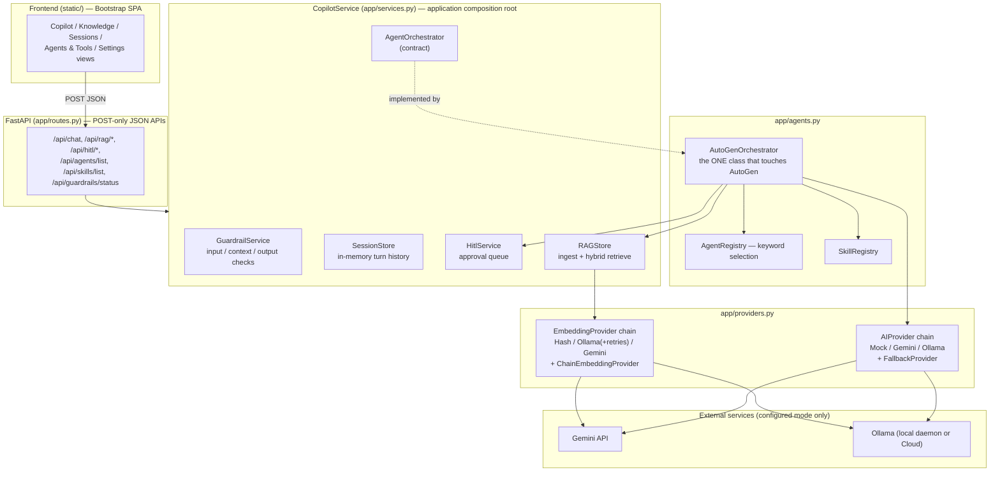
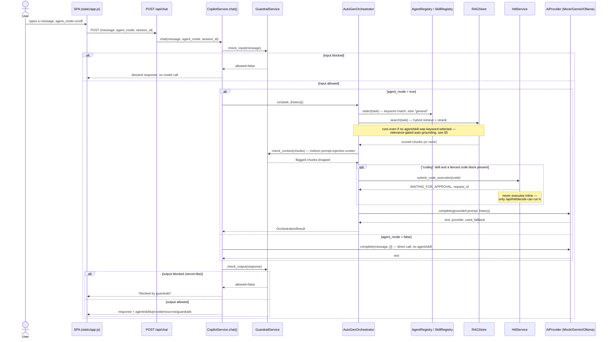
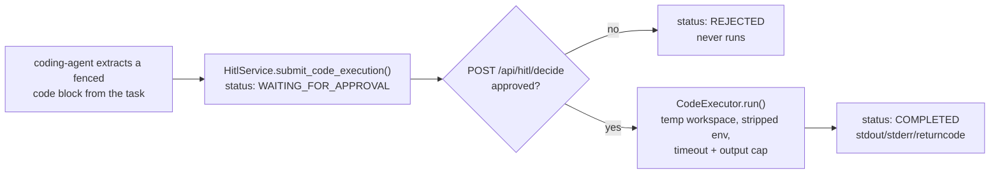

# Agent Architecture — Enterprise Copilot

How a message gets from the user to an answer: which layer decides what, where AutoGen
is (and isn't) actually involved, and how agents, skills, tools, and the knowledge base
fit together. Companion to `docs/agent-architecture.md` (implementation-level notes) and
`docs/rag.md` (retrieval pipeline detail) — this file is the narrative overview.

## 1. System architecture



**Boundary rule** (`.claude/rules/autogen-maf.md`): application code depends only on the
abstract `AgentOrchestrator.run()` contract. Every AutoGen-specific import and call lives
inside `AutoGenOrchestrator` and nowhere else — routes, `CopilotService`, the UI, and even
`AgentRegistry`/`SkillRegistry` never import `autogen_agentchat`. A future MAF
implementation swaps in behind the same contract without touching anything upstream.

## 2. What AutoGen actually does here (read this before assuming more)

Agent selection, skill dispatch, RAG grounding, and HITL gating are all hand-written Python
inside `AutoGenOrchestrator.run()` (`app/agents.py`) — AutoGen supplies message types and,
where it's genuinely warranted (below), a real agent/model-client runtime; it never supplies
the orchestration *logic* itself. This is intentional, not a stub someone forgot to finish:
it keeps the AutoGen surface area confined and swappable (`.claude/rules/autogen-maf.md`)
while the actual multi-agent behavior — which agent, which skill, whether to ground on the
knowledge base, whether a tool needs human approval — lives in code that has nothing
AutoGen-specific about it and will port to MAF (or anything else) unchanged.

The AutoGen footprint itself is confined to exactly two files, both by design
(`.claude/rules/autogen-maf.md`) — nothing else in the app imports `autogen_agentchat`:

- **`app/agents.py`** (`AutoGenOrchestrator`) — `autogen_agentchat.messages.TextMessage`
  represents conversation history/the current turn for every turn. When MCP tools are
  configured *and* available (`app/mcp_tools.py`) *and* a real AutoGen model client can be
  built for whatever provider is configured (see below), one turn additionally runs a real
  `AssistantAgent` wired to those tools (`AutoGenOrchestrator._run_with_tools`), streamed
  through `on_messages_stream` so each tool call/result becomes a live progress event.
  Mock mode, missing credentials, no tools configured, or any failure partway through all
  fall straight back to the plain hand-written completion — this is additive, optional
  runtime infrastructure, not a replacement for the orchestration logic above it.
- **`app/streaming.py`** — the real-time token-streaming path for plain direct chat
  (`agent_mode` off, no skill/agent routing): a single `AssistantAgent` in a
  `RoundRobinGroupChat`, `model_client_stream=True`. `build_streaming_model_client()` here
  is shared by both files (streaming resolves the model client; `agents.py` reuses it for
  tool-calling) — see its docstring for the resolution rules (Gemini/Ollama's
  OpenAI-compatible endpoints, `None` when nothing's configured).

Everything upstream of both (routes, `CopilotService`, the UI, `AgentRegistry`/
`SkillRegistry`) still never imports `autogen_agentchat` — the boundary is which two files
may, not that AutoGen is absent from the runtime.

## 3. Request lifecycle: user → agent → tools → output



## 4. Agents and skills (`app/agents.py`)

Agent selection is keyword-based (`AgentRegistry.select`), always falling back to
`general` for anything that doesn't match:

| Agent | Trigger keywords | Skill | Purpose |
|---|---|---|---|
| `general` | *(none — the default)* | *(none)* | Direct, single-step responses |
| `coding-agent` | `code`, `bug`, `function`, `script`, `debug`, `implement`, `` ``` `` | `coding` | Implement/test/debug software |
| `research-agent` | `document`, `knowledge base`, `cite`, `source`, `according to` | `knowledge-rag` | Answer from indexed knowledge |
| `data-analysis-agent` | `csv`, `dataset`, `analyze`, `statistic`, `chart` | `data-analysis` | Analyze data, produce insights |

| Skill | Workflow |
|---|---|
| `coding` | Inspect → implement → test → fix → validate |
| `knowledge-rag` | Understand → hybrid retrieve (vector+BM25) → rerank → relevance gate → screen for injection → offer as context → answer → cite |
| `data-analysis` | Load → validate → profile → analyze → visualize → verify |

Both registries are introspectable at runtime: `POST /api/agents/list`, `POST /api/skills/list`.

## 5. Knowledge-rag isn't gated behind keywords alone

A literal reading of the table above would suggest `knowledge-rag` only runs when
`research-agent` gets keyword-selected. In `AutoGenOrchestrator.run()` it's broader: **every**
task gets a relevance-gated retrieval check, regardless of which agent was selected —

```python
if "knowledge-rag" in skills_used:
    sources = await self.rag_store.search(task, limit=3)
else:
    candidates = await self.rag_store.search(task, limit=3)
    sources = [s for s in candidates if self._is_relevant(s)]
    if sources:
        skills_used.append("knowledge-rag")
        agent_name = "research-agent"
```

`_is_relevant` requires genuine lexical overlap (`bm25_score > 0`) **and** a reranker score
clearing `RELEVANCE_MIN_RERANK` (0.15, calibrated against real retrieval scores — see the
comment above the constant in `app/agents.py`). This means: ask something the knowledge base
can actually answer, with no special phrasing, and it grounds automatically; ask something
unrelated, and it doesn't.

Because that gate is a cheap heuristic on a small in-memory corpus, it isn't trusted as the
final word on relevance either — retrieved context is *offered* to the model, not forced:

> "...may or may not be relevant. If it genuinely helps, use it and cite it. If it doesn't
> address the question, ignore it completely and answer from your own knowledge — never
> claim you lack information just because this excerpt doesn't cover it."

So a weak/irrelevant hit that slips past the gate doesn't turn into a refusal — the model
makes the final relevance call itself. See `docs/rag.md` for the full pipeline and its
documented caveats (the embedder and reranker are lightweight stand-ins, not trained models).

## 6. Tools: code execution (gated by HITL) and MCP tool-calling

Two distinct tool mechanisms, not to be confused: code execution only ever *queues* (a
human must approve before anything runs); MCP tools *genuinely run* when the model decides
to call one (see `docs/tools.md`).

Local Python execution (`CodeExecutor`) is queued, never run inline by the orchestrator:



`CodeExecutor` runs in a temporary directory with a scrubbed environment (no `.env`/secrets
passthrough), a timeout (`MAX_CODE_EXECUTION_SECONDS`), and an output cap — development-only,
explicitly not a secure sandbox (`.claude/rules/security.md`).

MCP (Model Context Protocol) tools, by contrast, actually run — `app/mcp_tools.py` loads
them once per process (a local stdio server, bundled and on by default, plus an optional
remote server) and caches the list; `AutoGenOrchestrator._run_with_tools` (§2 above) attaches
whatever loaded to a real `AssistantAgent`, which decides for itself whether calling one
genuinely helps a given turn. No HITL gate here (unlike code execution) — these are curated,
safe-by-construction utility tools (see `mcp_servers/general_tools_server.py`), not arbitrary
code. See `docs/tools.md` for configuration and `docs/observability.md` for how a tool-calling
turn shows up in Langfuse when tracing is enabled.

## 7. Providers: AI completion and embeddings

Both follow the same shape — a small abstract interface, a chain of implementations, always
degrading to something that works rather than failing the request:

| | Mock mode (`AI_MODE=mock`, default) | Configured mode (`AI_MODE=configured`) |
|---|---|---|
| **Chat** (`AIProvider`) | `MockProvider` — deterministic, offline | `FallbackProvider(primary, mock)` — `GeminiProvider` or `OllamaProvider` per `MODEL_PROVIDER`, degrades to mock on any failure |
| **Embeddings** (`EmbeddingProvider`) | `HashEmbeddingProvider` — deterministic offline hashing-trick vector | `ChainEmbeddingProvider` — see below |

Embedding chain when `MODEL_PROVIDER=ollama`: `OllamaEmbeddingProvider` (tries the
configured model, then a short list of other well-known Ollama embedding models on the same
host, caching whichever works — and caching total failure too, so it doesn't re-probe every
chunk) → `GeminiEmbeddingProvider` as a cross-provider safety net → `HashEmbeddingProvider`
as the always-available final step. Every request/response reports `provider` and
`used_fallback` so degraded responses are never silent.

## 8. Guardrails: three checkpoints, not one

`GuardrailService` (Phase 0, `app/services.py`) runs at three distinct points in the same
request, each independently visible in the response's `guardrails` object:

1. **`check_input`** — the user's message, before any retrieval or model call (blocks
   prompt-injection-style phrases).
2. **`check_context`** — retrieved knowledge-base chunks, before they enter the prompt
   (blocks indirect prompt injection from a compromised/malicious document — flagged chunks
   are dropped from both the prompt and the cited sources).
3. **`check_output`** — the generated answer, before it reaches the client (blocks
   secret-looking output).

`context` is `null` whenever no retrieval happened (direct mode, or agent mode with nothing
relevant found) — its presence in a response is itself a signal that grounding occurred.

## 9. State model (v1 is intentionally in-memory)

Everything — sessions, documents/chunks, HITL requests — lives in plain Python objects
inside the single `CopilotService` instance created at import time (`app/services.py`). There
is no database and no persistence: a process restart clears all of it. This is a deliberate
v1 choice (`.claude/rules/architecture.md`: "keep infrastructure in-memory/local... unless
the specification requires otherwise"), not an oversight — every store's docstring says so
where it matters (`SessionStore`, `RAGStore`).

## 10. API surface

All application behavior is POST with a JSON body — no query parameters, per
`.claude/rules/api.md`:

| Endpoint | Purpose |
|---|---|
| `POST /api/chat` | Send a message; `agent_mode` selects direct vs. orchestrated |
| `POST /api/session/start` | Create a session explicitly |
| `POST /api/guardrails/status` | Phase/enabled/active checks |
| `POST /api/rag/document/add\|list\|get\|update\|delete` | Knowledge base CRUD (re-index is immediate, no separate call) |
| `POST /api/agents/list`, `POST /api/skills/list` | Registry introspection |
| `POST /api/tools/code/submit` | Queue code for HITL-gated execution |
| `POST /api/hitl/list\|get\|decide` | HITL approval queue |

## 11. Extension points

- **MAF migration**: implement `AgentOrchestrator.run()` in a new class, swap it into
  `CopilotService.__init__`. Nothing else changes (`.claude/rules/autogen-maf.md`).
- **Real vector DB / trained embedder / cross-encoder reranker**: all sit behind
  `RAGStore`'s existing method signatures (`add`, `update`, `delete`, `list`, `get`,
  `search`) and `EmbeddingProvider.embed()` — see `docs/rag.md` for exactly what's a
  lightweight v1 stand-in today.
- **New agent/skill**: register an `AgentDefinition`/`SkillDefinition` in
  `default_agent_registry()`/`default_skill_registry()`; wire any new tool invocation into
  `AutoGenOrchestrator.run()` behind HITL if it has side effects.
